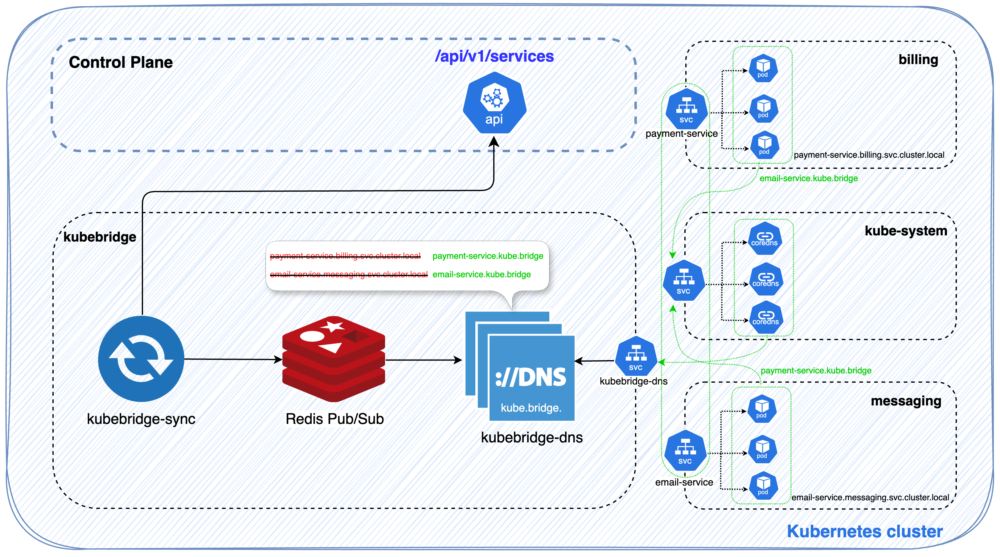

<h1 align="center" style="border-bottom: none">
    <a href="https://kubebridge.io" target="_blank"></a><br>KubeBridge
</h1>

_Discover, bridge, and resolve services in Kubernetes_

<div align="center">


[](https://github.com/hayk96/kubebridge/releases)


[](https://hub.docker.com/r/hayk96/kubebridge/)
[](https://hub.docker.com/r/hayk96/kubebridge/)
[](https://hub.docker.com/r/hayk96/kubebridge/)

</div>

<!-- TABLE OF CONTENTS -->
<details open="open">
  <summary>Table of Contents</summary>
  <ol>
    <li>
      <a href="#about-the-project">About The Project</a>
    </li>
    <li>
      <a href="#architecture-overview">Architecture Overview</a>
    </li>
    <li>
      <a href="#components">Components</a>
    </li>
    <li>
      <a href="#features">Features</a>
    </li>
    <li>
      <a href="#installation">Installation</a>
    </li>
    <li>
      <a href="#configuration">Configuration</a>
      <ul>
        <li><a href="#sync">Sync</a></li>
        <ul>
        <li><a href="#service-discovery-by-namespace">Service discovery by namespace</a></li>
        <li><a href="#service-discovery-by-service-type">Service discovery by service type</a></li>
        <li><a href="#service-discovery-by-service-annotations">Service discovery by service annotations</a></li>
        </ul>
      </ul>
      <ul>
        <li>
          <a href="#dns">DNS</a>
          <ul>
            <li><a href="#search-domain">Search domain</a></li>
            <li><a href="#custom-dns-configuration">Custom DNS configuration</a></li>
          </ul>
        </li>
      </ul>
    </li>
    <li><a href="#resolve-kubebridge-dns-requests-in-kubernetes">Resolve KubeBridge DNS requests in Kubernetes</a></li>
    <li><a href="#coredns-configuration">CoreDNS configuration</a></li>
    <li><a href="#kubedns-configuration">KubeDNS configuration</a></li>
    <li><a href="#roadman">Roadmap</a></li>
    <li><a href="#author-and-maintainer">Author and Maintainer</a></li>
    <li><a href="#license">License</a></li>
  </ol>
</details>


## About The Project
KubeBridge is a Kubernetes-native service discovery and DNS resolution tool that simplifies cross-namespace service 
communication within a cluster. It automatically maps Kubernetes services to DNS records in real-time, enabling continuous 
service discovery and resolution without manual configuration.

## Architecture Overview


## Components
* **Sync** - Continuously syncs and maps Kubernetes services with DNS records real-time.
* **DNS** - Resolves service names to Kubernetes service IP addresses.
* **Redis** - A Pub/Sub messaging system for K8s service discovery used by Sync and DNS apps.

## Features
* **Service Discovery:** Automatically registers Kubernetes services and makes them resolvable via DNS.
* **DNS Resolution:** Services can be queried using `*.kube.bridge` domain (e.g., `my-service.kube.bridge`) without specifying namespace.
* **Custom DNS Configuration:** Supports overriding or adding new Kubernetes DNS settings for advanced use cases.

## Installation
KubeBridge can be installed using Helm. The following steps will guide you through the installation process.
```shell
helm repo add kubebridge https://hayk96.github.io/kubebridge
helm repo update
helm install kubebridge kubebridge/kubebridge -n kubebridge --create-namespace
```

## Configuration
### Sync
#### Service discovery by namespace
With the following configuration, KubeBridge will sync all services from all namespaces except `kube-system` and `kube-public`.
```yaml
sync:
  allowNamespaces: ["*"]
  denyNamespaces: ["kube-system", "kube-public"]
```

#### Service discovery by service type
With the following configuration, KubeBridge will sync services with the specified service types only.
```yaml
sync:
  allowServiceTypes:
    - NodePort
    - ClusterIP
    - LoadBalancer
```

#### Service discovery by service annotations
Service synchronization can be controlled based on service annotations. If the annotation `kubebridge.io/service-sync` is set to `true` on a service, that service will be explicitly synced with KubeBridge. Setting the value to `false` will disable the service sync.
```yaml
apiVersion: v1
kind: Service
metadata:
  name: example-service
  annotations:
    kubebridge.io/service-sync: "true"
spec:
  selector:
    app: example-app
  ports:
    - protocol: TCP
      port: 80
      targetPort: 80
  type: ClusterIP
```

### DNS
#### Search domain
Service names can be resolved using the `*.kube.bridge` domain.
```yaml
dns:
  domain: kube.bridge
```

#### Custom DNS configuration
Custom DNS configuration can be set to map service names to IP addresses.
```yaml 
dns:
  extraDNSConfig: |
    {
      "A": {
        "kubebridge.io.": [
          "127.0.0.1"
        ]
      },
      "CNAME": {
        "kube-bridge.io": "kubebridge.io."
      }
    }
```

## Resolve KubeBridge DNS requests in Kubernetes
Depending on the DNS server used in the cluster, you can apply the following configurations to resolve KubeBridge DNS requests. To configure CoreDNS or KubeDNS, you'll first need the ClusterIP of the `kubebridge-dns` service created by the Helm chart.
```yaml
$ kubectl -n kubebridge get svc kubebridge-dns --output jsonpath='{.spec.clusterIP}'
10.96.244.221
```

### CoreDNS configuration
For CoreDNS, you need to update the existing coredns ConfigMap in the kube-system namespace to include a forward definition for kubebridge, pointing to the cluster IP of the kubebridge-dns service.
```yaml
apiVersion: v1
kind: ConfigMap
metadata:
  name: coredns
  namespace: kube-system
data:
  Corefile: |
    .:53 {
        errors
        health
        kubernetes cluster.local in-addr.arpa ip6.arpa {
           pods insecure
           fallthrough in-addr.arpa ip6.arpa
        }
        prometheus :9153
        forward . 172.16.0.1
        cache 30
        loop
        reload
        loadbalance
    }
    kube.bridge: |  
      kube.bridge:53 {  
        errors  
        cache 30  
        forward . 10.96.244.221
        reload  
      }
```

### KubeDNS configuration
The following example ConfigMap manifest for kube-dns includes a stubDomains configuration that sets resolver for the domain kube.bridge.
```yaml
apiVersion: v1
kind: ConfigMap
metadata:
  labels:
    addonmanager.kubernetes.io/mode: EnsureExists
  name: kube-dns
  namespace: kube-system
data:
  stubDomains: |
    {
      "kube.bridge": [
        "10.96.244.221"
      ]
    }
```

## Roadmap
- [ ] Support exporting Prometheus metrics.
- [ ] Support Kubernetes CRDs to manage custom DNS configurations.
- [ ] Support traffic management for service discovery.

## Author and Maintainer
Hayk Davtyan:
- Email - hayko5999@gmail.com
- GitHub - [hayk96](https://github.com/hayk96)

## License
MIT License, see [LICENSE](https://github.com/hayk96/kubebridge/blob/main/LICENSE).